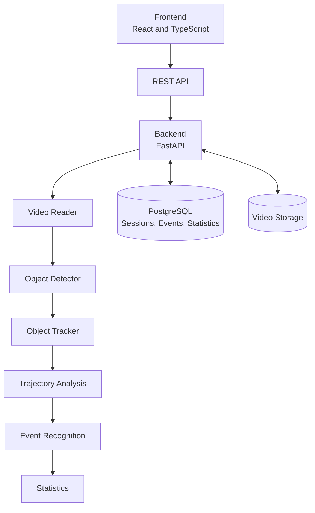
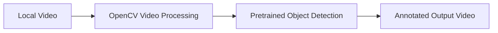
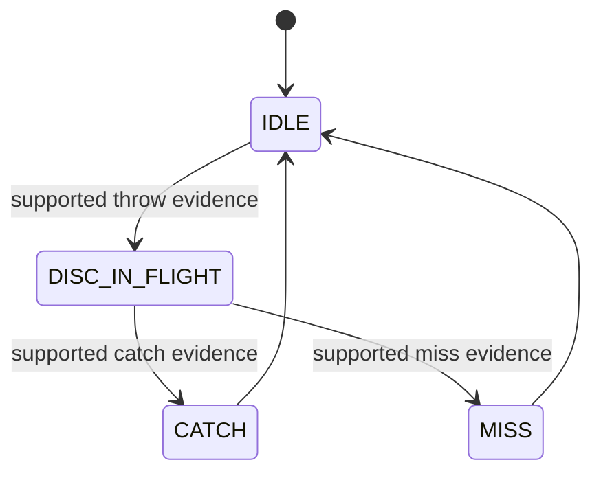

# System Architecture

## Architecture Principles

The project separates object detection, object tracking, trajectory analysis, and event recognition. A disc detection provides an observation; it does not on its own establish that a throw or catch happened. Each stage should expose outputs that can be inspected and evaluated independently.

## Future Architecture

The following diagram is a proposed direction, not an implemented system.

PostgreSQL is a future candidate for session, event, and statistics storage. Local video storage may be used during development; object storage may be considered later. Neither database nor video storage integration is implemented in this version.

## Current Architecture

Only the local feasibility path is implemented:

The current tools also inspect video metadata and extract selected frames. They do not track identities or recognise events.

Small and fast disc detection is currently one of the highest technical risks. Therefore, detection feasibility should be evaluated before significant frontend and backend development.

## Component Responsibilities

| Component | Responsibility | Status |
|---|---|---|
| Video reader | Open a local video and provide frames and metadata. | Implemented for feasibility use |
| Object detector | Observe dog, frisbee, and person classes using a pretrained model. | Implemented as an unevaluated baseline |
| Object tracker | Link object observations across frames. | Planned |
| Trajectory analysis | Derive motion evidence from tracked objects. | Planned |
| Event recognition | Classify throw, catch, miss, and uncertain events using agreed definitions. | Planned |
| Statistics | Aggregate reviewed events into session measures. | Planned |
| REST API and web interface | Support upload, review, correction, and history workflows. | Planned |
| Database | Retain approved session and event records. | Planned |

## Future Event State Machine

Proposed design only. Not implemented in the current version. Event definitions, evidence thresholds, ambiguous cases, and correction rules must be agreed before implementation.

